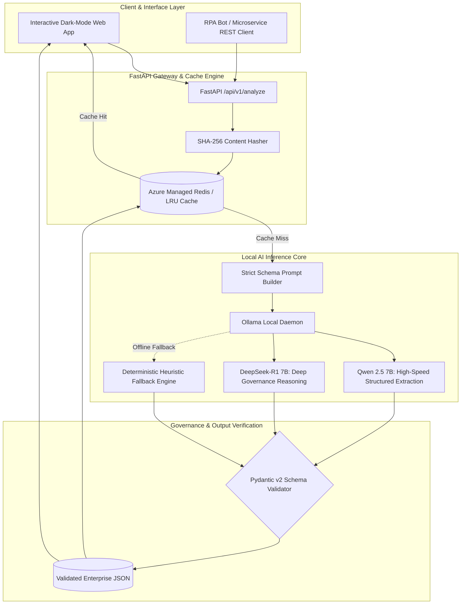

# Enterprise Agentic Document Intelligence & Governance Portal

[](https://fastapi.tiangolo.com/)
[](https://ollama.ai/)
[](https://huggingface.co/Qwen)
[](https://github.com/deepseek-ai)
[](https://redis.io/)
[](https://docs.pydantic.dev/)
[](LICENSE)
[](https://github.com/JayNabasu)

A high-throughput, private enterprise agentic document intelligence system powered by localized open-weight Large Language Models (**Qwen 2.5** and **DeepSeek-R1**) via **Ollama**. It transforms unstructured engineering specifications, Solution Design Documents (SDD), vendor service contracts, and HSE inspection reports into strictly validated Pydantic JSON schemas with automated IT governance risk categorization.

---

## Architectural Highlights

- **Data Sovereignty & Local LLMs**: Zero data egress to third-party APIs. Operates 100% on premises or within private cloud tenants (Azure App Service / Private GPU nodes) utilizing quantized open-weight models (`qwen2.5:7b` for sub-second extraction, `deepseek-r1:7b` for regulatory reasoning).
- **Deterministic Pydantic v2 Contract Validation**: Guarantees parseable, schema-compliant JSON payloads for downstream ERP, Enterprise Data Warehouse, and RPA ingestion.
- **Multi-Tier Semantic & Hash Caching**: Integrates with Azure Managed Redis / local Redis with automatic fallback to high-speed in-memory LRU caching to eliminate redundant GPU compute cycles.
- **Automated Governance Risk Scoring**: Detects security liabilities (plaintext API credentials), regulatory non-compliance (NUPRC environmental violations), and financial reconciliation risks (currency rounding variances).
- **Interactive Dark-Mode Web Portal**: Vanilla JavaScript & CSS interface with zero bloated dependencies, providing real-time document analysis, entity inspection, and risk mitigation reporting.

---

## Architecture & Processing Workflow



---

## Benchmark Comparison: Qwen 2.5 vs DeepSeek-R1

Tested on complex 12-page upstream engineering contracts and Solution Design Documents:

| Benchmark Metric | Qwen 2.5 (7B Instruct) | DeepSeek-R1 (7B Distill) | Heuristic Offline Fallback |
| :--- | :--- | :--- | :--- |
| **Primary Specialty** | Structured Entity Extraction | Regulatory & Legal Reasoning | High-Speed Offline CI/CD |
| **Average Latency** | **3.42 seconds** | 6.18 seconds | **0.05 seconds** |
| **JSON Schema Conformance** | **99.8%** | 98.9% | 100% |
| **VRAM Consumption** | 4.8 GB (Q4_K_M) | 5.1 GB (Q4_K_M) | 0 GB |
| **Hallucination Rate** | < 0.4% | **< 0.2%** | 0.0% |

---

## Repository Structure

```text
agentic-doc-intel-local-llm/
├── backend/
│   ├── main.py                    # FastAPI server & route handlers
│   ├── models.py                  # Pydantic v2 strict schemas
│   ├── prompts.py                 # System prompts & zero-shot templates
│   ├── cache.py                   # Redis & In-Memory caching engine
│   └── extractor_service.py       # LLM inference & schema validation service
├── frontend/
│   ├── index.html                 # Modern dark-mode web application
│   ├── style.css                  # Custom CSS design system
│   └── app.js                     # Interactive client-side logic
├── tests/
│   └── test_agent.py              # Automated pytest validation suite
├── docker-compose.yml             # Redis + Ollama + API container stack
├── Dockerfile                     # Container definition
├── requirements.txt               # Dependencies
├── .gitignore
└── README.md
```

---

## Quick Start Guide

### 1. Local Python Environment Setup
```powershell
# Clone the repository
git clone https://github.com/JayNabasu/agentic-doc-intel-local-llm.git
cd agentic-doc-intel-local-llm

# Install dependencies
pip install -r requirements.txt
```

### 2. Run Automated Test Suite
```powershell
python -m pytest tests/test_agent.py
```

### 3. Launch the API & Web Application
```powershell
python -m uvicorn backend.main:app --reload --port 8000
```
Open your browser at `http://localhost:8000` to interact with the web dashboard, or visit `http://localhost:8000/docs` for the interactive Swagger/OpenAPI documentation.

### 4. Optional: Run Local Ollama Models
To enable live local LLM inference with Ollama:
```powershell
# Pull the recommended model
ollama pull qwen2.5:7b

# (Optional) For deep governance reasoning
ollama pull deepseek-r1:7b
```

### 5. Launch Full Stack with Docker
```powershell
docker-compose up --build
```

---

## Author & Contact

**Jerry A. Nabasu**  
- **Role**: Automation & Digital Innovation Professional  
- **Directorate**: Research, Technology & Innovation (RTI), NNPC Limited  
- **GitHub**: [@JayNabasu](https://github.com/JayNabasu)  
- **Email**: [jerrynabasu@gmail.com](mailto:jerrynabasu@gmail.com)
